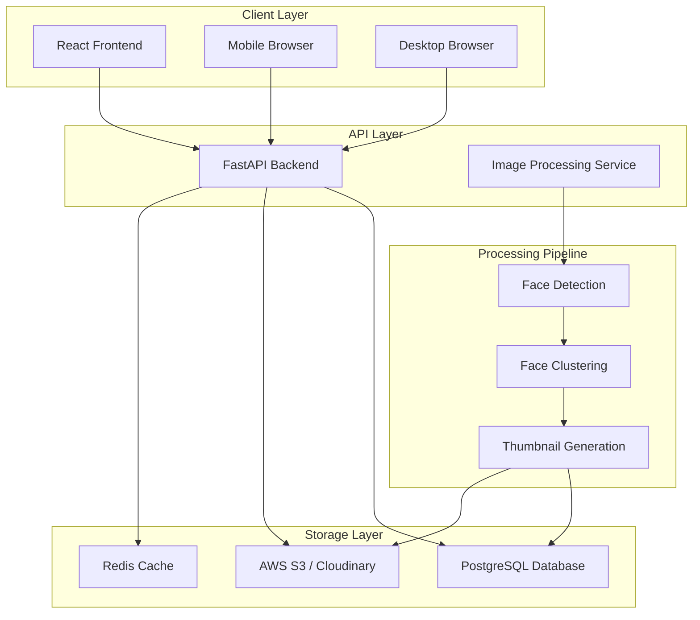

# Design Document

## Overview

The Personal Event Photo Gallery with Smart Face Recognition is built as a modern web application with a React frontend and Python FastAPI backend. The system processes event photos through a machine learning pipeline that detects faces, clusters them by person, and serves personalized photo collections through a clean, responsive interface.

The architecture separates concerns between photo processing (offline batch job), API services (real-time), and frontend presentation, enabling scalable deployment and optimal user experience.

## Architecture



### System Flow

1. **Photo Upload & Processing**: Event organizer uploads photos to processing pipeline
2. **Face Detection**: Python face_recognition library detects faces in all images
3. **Face Clustering**: DBSCAN algorithm groups similar faces by person
4. **Data Storage**: Face embeddings, clusters, and metadata stored in PostgreSQL
5. **Image Optimization**: Thumbnails and web-optimized versions generated and stored in S3/Cloudinary
6. **Gallery Access**: Visitors browse face thumbnails and access personalized photo collections

## Components and Interfaces

### Frontend Components

#### GalleryHomepage
- **Purpose**: Display face thumbnails for person selection
- **Props**: `personThumbnails: PersonThumbnail[]`
- **State**: Loading states, error handling
- **Key Features**: Responsive grid layout, lazy loading, click handlers

#### PersonGallery  
- **Purpose**: Display all photos for selected person
- **Props**: `personId: string, photos: Photo[]`
- **State**: Photo viewing mode, download states
- **Key Features**: Image gallery with zoom, download buttons, navigation

#### PhotoViewer
- **Purpose**: Full-screen photo viewing with controls
- **Props**: `photo: Photo, onClose: () => void, onNext: () => void, onPrev: () => void`
- **State**: Loading, zoom level, download progress
- **Key Features**: Keyboard navigation, touch gestures, download functionality

### Backend API Endpoints

#### GET /api/persons
- **Purpose**: Retrieve all detected persons with thumbnails
- **Response**: `{ persons: PersonThumbnail[] }`
- **Caching**: Redis cache for 1 hour

#### GET /api/persons/{person_id}/photos
- **Purpose**: Get all photos containing specific person
- **Response**: `{ photos: Photo[], total: number }`
- **Features**: Pagination, metadata inclusion

#### GET /api/photos/{photo_id}/download
- **Purpose**: Serve original quality photo for download
- **Response**: Binary image data with appropriate headers
- **Features**: Streaming, CDN integration

### Data Models

#### Person
```typescript
interface Person {
  id: string;
  thumbnail_url: string;
  photo_count: number;
  face_embedding: number[]; // 128-dimensional face encoding
  cluster_confidence: number;
  created_at: string;
}
```

#### Photo
```typescript
interface Photo {
  id: string;
  original_url: string;
  thumbnail_url: string;
  web_url: string; // Optimized for web viewing
  filename: string;
  width: number;
  height: number;
  file_size: number;
  taken_at?: string;
  persons: string[]; // Array of person IDs detected in photo
}
```

#### FaceDetection
```typescript
interface FaceDetection {
  id: string;
  photo_id: string;
  person_id: string;
  bounding_box: {
    top: number;
    right: number;
    bottom: number;
    left: number;
  };
  confidence: number;
  face_embedding: number[];
}
```

## Processing Pipeline

### Face Detection Service
- **Library**: Python face_recognition (dlib-based)
- **Input**: Raw event photos from upload directory
- **Process**: 
  1. Load image and convert to RGB
  2. Detect face locations using HOG + CNN models
  3. Extract 128-dimensional face encodings
  4. Store face data with bounding boxes
- **Output**: Face embeddings and metadata in database

### Face Clustering Service
- **Algorithm**: DBSCAN clustering on face embeddings
- **Parameters**: 
  - `eps=0.6` (distance threshold for same person)
  - `min_samples=2` (minimum faces to form cluster)
- **Process**:
  1. Load all face embeddings from database
  2. Calculate euclidean distances between embeddings
  3. Apply DBSCAN to group similar faces
  4. Assign person IDs to clusters
  5. Handle outliers as individual persons
- **Output**: Person clusters with confidence scores

### Image Optimization Service
- **Library**: Pillow (PIL) for Python image processing
- **Formats**: Generate multiple sizes per image
  - Thumbnail: 300x300px (for person selection)
  - Web: 1200px max dimension (for gallery viewing)
  - Original: Unchanged (for downloads)
- **Optimization**: JPEG quality 85%, progressive encoding
- **Storage**: Upload optimized versions to S3/Cloudinary with CDN

## Error Handling

### Frontend Error Handling
- **Network Errors**: Retry mechanism with exponential backoff
- **Loading States**: Skeleton screens and progress indicators
- **Image Load Failures**: Fallback placeholders and retry options
- **User Feedback**: Toast notifications for errors and success states

### Backend Error Handling
- **Face Detection Failures**: Log errors, continue processing other photos
- **Database Errors**: Connection pooling, transaction rollbacks
- **Storage Errors**: Retry uploads, fallback to local storage temporarily
- **API Errors**: Structured error responses with appropriate HTTP status codes

### Processing Pipeline Error Handling
- **Invalid Image Formats**: Skip with warning, continue batch processing
- **Face Detection Failures**: Log photo ID, mark as processed without faces
- **Clustering Errors**: Fallback to individual person assignment
- **Storage Upload Failures**: Retry with exponential backoff, alert on persistent failures

## Testing Strategy

### Unit Testing
- **Frontend**: Jest + React Testing Library for component testing
- **Backend**: pytest for API endpoint testing
- **Processing**: Unit tests for face detection and clustering algorithms
- **Coverage Target**: 80% code coverage minimum

### Integration Testing
- **API Integration**: Test complete request/response cycles
- **Database Integration**: Test data persistence and retrieval
- **Storage Integration**: Test image upload/download workflows
- **Pipeline Integration**: End-to-end photo processing tests

### Performance Testing
- **Load Testing**: Simulate concurrent users accessing galleries
- **Image Processing**: Benchmark face detection speed on various image sizes
- **Database Performance**: Query optimization for large photo collections
- **CDN Performance**: Test image delivery speeds globally

### User Acceptance Testing
- **Face Recognition Accuracy**: Test with diverse photo sets
- **Mobile Responsiveness**: Test on various device sizes
- **User Experience**: Navigation flow and download functionality
- **Privacy Validation**: Ensure users only see their photos

## Security Considerations

### Data Privacy
- **Face Data**: Store only mathematical embeddings, not raw face images
- **Anonymous Access**: No user accounts or personal information required
- **Data Retention**: Clear policies for face data storage duration

### API Security
- **Rate Limiting**: Prevent abuse of download endpoints
- **CORS Configuration**: Restrict cross-origin requests appropriately
- **Input Validation**: Sanitize all user inputs and file uploads

### Infrastructure Security
- **HTTPS**: Enforce SSL/TLS for all communications
- **Storage Security**: Secure S3 bucket configurations
- **Database Security**: Connection encryption and access controls